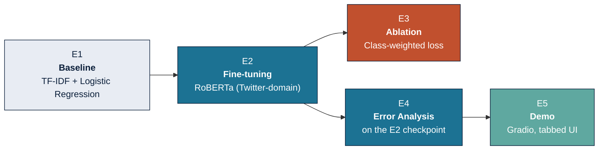
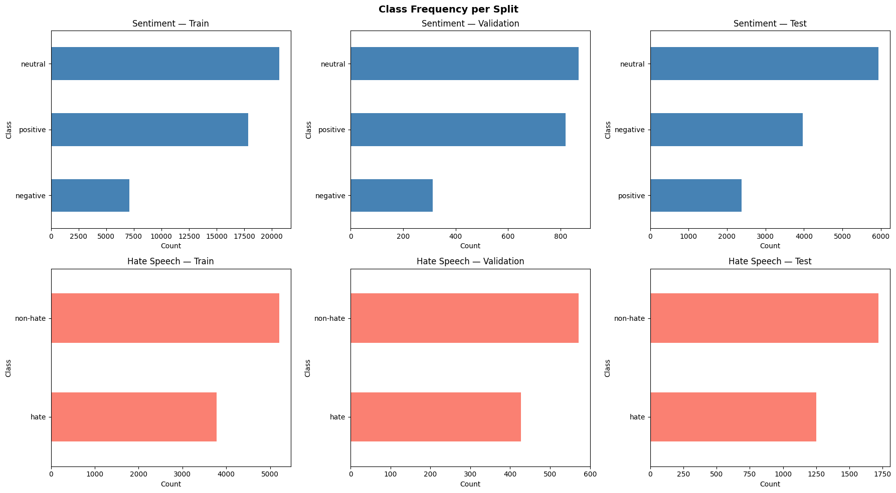
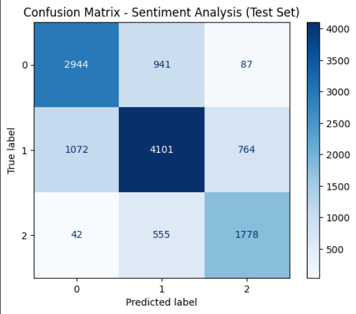
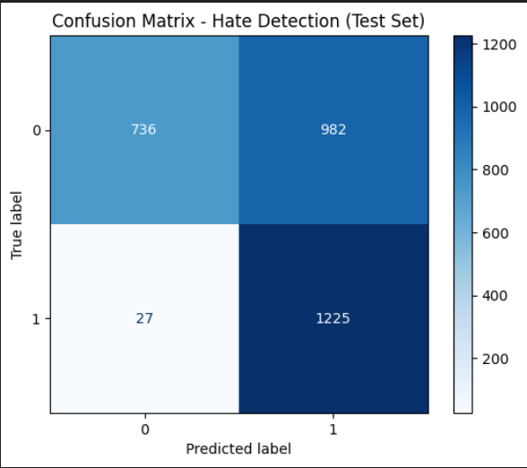

<div align="center">

# Social Media Sentiment Analysis and Hate Detection System

**Two fine-tuned RoBERTa classifiers on TweetEval — 3-class sentiment and binary hate speech — built as a five-experiment (E1–E5) NLP capstone pipeline.**


</div>

> **A note on tone before you read further:** this README reports what the experiments actually found, including the ones that didn't work. The weighted-loss ablation (E3) is a documented negative result. The hate detection model has an unresolved 20-point validation→test generalization gap. Both are stated plainly below rather than buried or spun as partial successes — see [Key Findings](#key-findings-including-what-didnt-work).

---

## Table of Contents

- [Overview](#overview)
- [Pipeline](#pipeline)
- [Repository Structure](#repository-structure)
- [Dataset](#dataset)
- [Results](#results)
- [Key Findings (Including What Didn't Work)](#key-findings-including-what-didnt-work)
- [Limitations](#limitations)
- [Setup](#setup)
- [Usage](#usage)
- [Demo](#demo)
- [Future Work](#future-work)
- [References](#references)

---

## Overview

This project trains two **independent** text classifiers on [TweetEval](https://huggingface.co/datasets/cardiffnlp/tweet_eval):

| Task | Classes | Best Model | Test Macro-F1 |
|---|---|---|---|
| **Sentiment Analysis** | negative / neutral / positive | RoBERTa (E2) | **0.718** |
| **Hate Speech Detection** | non-hate / hate | RoBERTa (E2) | **0.651** |

The project follows a mandatory five-experiment structure: a classical baseline, transformer fine-tuning, a technical ablation, a structured error analysis, and a deployed demo.

## Pipeline



Note E3 branches from E2 but does **not** feed into E4 — error analysis is deliberately performed on the E2 checkpoint, not E3, because E3 is a regression (see below).

## Repository Structure

```
Sentiment-and-Hate-detection-using-NLP/
├── data_analysis.ipynb        # E1 — EDA: label distributions, length stats, noise audit
├── baseline_model.ipynb       # E1 — TF-IDF + Logistic Regression baseline
├── transformer_model.ipynb    # E2 — RoBERTa fine-tuning (both tasks)
├── improvement.ipynb          # E3 — Class-weighted loss ablation (sentiment only)
├── error_analysis.ipynb       # E4 — Quantitative + qualitative error analysis
├── app.py                     # E5 — Gradio demo (tabbed sentiment / hate UI)
├── requirements.txt
├── assets/                    # Charts embedded in this README (tracked)
└── README.md
```

**Not tracked in this repository** (see [`.gitignore`](.gitignore)): `.ipynb_checkpoints/`, `others/` (local model checkpoint weights), `report/`, `results/`. This is a deliberate space/scope decision, not an oversight — see the callout in [Setup](#setup) for what this means practically if you clone this repo.

## Dataset

[TweetEval](https://huggingface.co/datasets/cardiffnlp/tweet_eval) (`cardiffnlp/tweet_eval`), `sentiment` and `hate` subsets, used independently.

| Subset | Train | Val | Test | Train-set balance |
|---|---|---|---|---|
| Sentiment (3-class) | 45,615 | 2,000 | 12,284 | Negative 16% · Neutral 45% · Positive 39% |
| Hate (binary) | 8,998* | 999* | 2,970 | Non-hate 58% · Hate 42% |

<sub>*after dropping empty rows found during the missing-value audit in `data_analysis.ipynb`</sub>

<p align="center">
  
</p>

**The sentiment test set is not distributed like the sentiment train set** — negative rises from 16% to 32%, positive falls from 39% to 19%. This is a known TweetEval benchmark artifact (not a bug in this project) and it is the primary explanation for the validation→test macro-F1 drop reported for the sentiment model below.

## Results

### Sentiment (test set)

| Model | Accuracy | Precision (macro) | Recall (macro) | Macro-F1 |
|---|---|---|---|---|
| TF-IDF + Logistic Regression (E1) | 0.591 | 0.60 | 0.57 | 0.56 |
| **RoBERTa (E2)** | **0.718** | 0.71 | 0.73 | **0.718** |
| RoBERTa + Weighted Loss (E3) | 0.699 | 0.70 | 0.73 | 0.702 |

### Hate Detection (test set)

| Model | Accuracy | Precision (macro) | Recall (macro) | Macro-F1 |
|---|---|---|---|---|
| TF-IDF + Logistic Regression (E1) | 0.490 | 0.59 | 0.55 | 0.45 |
| **RoBERTa (E2)** | **0.660** | 0.76 | 0.70 | **0.651** |

### E2 Confusion Matrices (test set)

<table>
<tr>
<td width="50%" align="center"><b>Sentiment</b><br></td>
<td width="50%" align="center"><b>Hate Detection</b><br></td>
</tr>
</table>

## Key Findings (Including What Didn't Work)

### ✅ RoBERTa fine-tuning is the dominant driver of performance
+0.158 macro-F1 for sentiment and +0.201 macro-F1 for hate over the TF-IDF baseline. Not a surprising result on its own, but it is the only unambiguous win in this project.

### ❌ E3's weighted-loss ablation is a negative result, not a "partial success"
The hypothesis was that reweighting cross-entropy loss (negative=2.14, neutral=0.74, positive=0.85) would fix neutral's tendency to absorb misclassified negative/positive tweets. **Macro-F1 fell from 0.718 to 0.702.** Negative-class F1 moved in the predicted direction (+0.01), but neutral collapsed (−0.06) — a net loss on the metric this project treats as primary. Manual review of misclassified examples found the actual cause is lexical-semantic ambiguity (politically charged vocabulary read as negative even in objectively neutral tweets), which loss reweighting cannot fix — it changes gradient weighting, not what the model can extract from the text.

### 🔍 "Neutral" is a bidirectional garbage-bin class (E4 finding)
95.8% of all sentiment misclassifications involve the neutral boundary in one direction or the other; genuine cross-polarity confusion (negative ↔ positive) accounts for only 4.2%. The single largest failure mode (42.0% of all errors) is Neutral → Negative, driven by over-sensitization to partisan/political vocabulary.

### ⚠️ The hate model has an unresolved 20-point validation→test gap
| Task | Val Macro-F1 | Test Macro-F1 | Gap |
|---|---|---|---|
| Sentiment (E2) | 0.754 | 0.718 | 3.6 pts |
| Hate (E2) | 0.854 | 0.651 | **20.3 pts** |

This gap **cannot** be explained by label distribution shift — validation and test label ratios are nearly identical (57.3%/42.7% vs. 57.8%/42.2%). The project documents this with reference to a known cross-dataset generalization pattern in hate-speech models ([Antypas & Camacho-Collados, 2023](#references)), but that is a citation of a general phenomenon, not an independent diagnosis of *this* test set — no topic/vocabulary overlap analysis was actually run. **Treat the 0.651 test macro-F1 as the best available estimate for hate detection, not a fully trusted number.**

## Limitations

1. Sentiment test-set distribution shift (16%→32% negative) is a TweetEval artifact, not fixable within this project.
2. Hate detection's 20.3-point val→test gap is undiagnosed at the root-cause level (see above).
3. A minority of hate-task tweets exceed the 128-token limit and are truncated; the impact on those specific examples is undocumented.
4. Training was done entirely on Kaggle (T4/P100); the batch size used (128) is not reproducible on the author's local RTX 2050 (4GB VRAM) without modification.
5. Some minor cross-notebook documentation inconsistencies exist (a raw-URL count and an accuracy figure each reported two different ways across notebooks). None affect any model result, but they haven't been corrected.
6. An informal n=9 manual spot-check of the deployed demo is not statistical evidence for or against any E4 finding — it validates only that the inference pipeline runs correctly end-to-end.

## Setup

```bash
git clone https://github.com/Parmar-Dhruv/Sentiment-and-Hate-detection-using-NLP.git
cd Sentiment-and-Hate-detection-using-NLP
pip install -r requirements.txt
```

> **This repository does not include trained model weights.** The `others/` folder (containing the fine-tuned `sentiment_model` and `hate_model` checkpoints used by `app.py`) is intentionally excluded from version control — checkpoint weights for two RoBERTa-base models are too large for a standard git repo and don't belong in it. To run `app.py` after cloning, you must either:
> - run `transformer_model.ipynb` yourself (on Kaggle or a GPU machine) to reproduce the checkpoints, or
> - point `SENTI_MODEL_PATH` and `HATE_MODEL_PATH` in `app.py` to wherever you've stored your own trained checkpoints.
>
> There is currently no hosted/downloadable copy of the trained weights linked from this repo.

## Usage

Run notebooks in dependency order — each stage assumes the previous one's outputs exist:

```
1. data_analysis.ipynb      →  EDA, cleaned dataframes
2. baseline_model.ipynb     →  E1 baseline metrics
3. transformer_model.ipynb  →  E2 checkpoints (required for E3, E4, E5)
4. improvement.ipynb        →  E3 ablation (reads the E2 checkpoint as a fixed comparison point)
5. error_analysis.ipynb     →  E4 (reads the E2 checkpoint — never E3)
```

## Demo

```bash
python app.py
```

Launches a local Gradio app with two tabs — **Sentiment Analysis** and **Hate Detection** — sharing a single `clean_text()` preprocessing function that is kept byte-for-byte identical to what was used during E2 training (including a known `@user` regex edge case, preserved intentionally rather than "fixed," to keep train/inference behavior consistent).

## Future Work

- Diagnose the hate val→test gap directly (topic/vocabulary overlap analysis between splits) instead of relying on citation to precedent.
- Entity-aware contextualization so partisan entities in neutral, analytical framing stop being read as negative.
- Register-aware data augmentation targeting the Negative→Neutral (journalistic-tone) failure mode.
- Separate genuine model error from annotation-convention noise in the reported 28.3% sentiment error rate.

## References

- Barbieri, F., Camacho-Collados, J., Espinosa Anke, L., & Neves, L. (2020). *TweetEval: Unified Benchmark and Comparative Evaluation for Tweet Classification.* Findings of EMNLP 2020.
- Antypas, D., & Camacho-Collados, J. (2023). *Robust Hate Speech Detection in Social Media: A Cross-Dataset Empirical Evaluation.*
- [`cardiffnlp/twitter-roberta-base-sentiment-latest`](https://huggingface.co/cardiffnlp/twitter-roberta-base-sentiment-latest)
- [`cardiffnlp/twitter-roberta-base-hate-latest`](https://huggingface.co/cardiffnlp/twitter-roberta-base-hate-latest)

---

<div align="center">
<sub>Dhruv Parmar · BTech Computer Engineering, Semester 4</sub>
</div>
